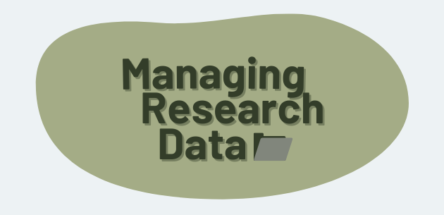

# Managing Research Data
Managing Research Data is a six lesson eLearning course built with Twine and H5P.

Managing data is an essential part of any research workflow.

Labs, teams, and individual researchers that depend on grant funding or expect to publish in journals need to plan for data management.

**[View on Twine.](https://kbneedscoffee.itch.io/mrd)**

